<div align="center">



[](https://github.com/ams/mom/releases)
[](https://go.dev)
[](https://github.com/ams/mom)
[](LICENSE)
[](https://github.com/ams/mom/releases)

An interactive, themeable TUI for crafting beautiful Linux MOTDs.  
No static text files — just live system data, smart defaults, and a gorgeous terminal interface.

[Installation](#installation) · [Quick Start](#quick-start) · [Modules](#modules) · [Themes](#themes) · [Templates](#templates) · [Configuration](#configuration)

</div>

---

<!-- Replace the image below with an animated GIF of the full TUI workflow (~900px wide).
     Ideal recording: launch mom → browse dashboard → toggle modules → preview MOTD → apply. -->
<div align="center">
  
  <br/>
  <sub><i>Interactive TUI — configure, preview, and apply your MOTD without leaving the terminal.</i></sub>
</div>

---

## Screenshots

<!-- Replace each image below with actual terminal screenshots (~420px wide each).
     Suggested tool: use `vhs` (https://github.com/charmbracelet/vhs) for consistent recordings. -->

<div align="center">
  <table>
    <tr>
      <td align="center">
        <br/>
        <sub><b>Dashboard</b> — 13-item menu, distro-aware</sub>
      </td>
      <td align="center">
        <br/>
        <sub><b>Module Selector</b> — toggle 32 modules individually</sub>
      </td>
    </tr>
    <tr>
      <td align="center">
        <br/>
        <sub><b>Theme Picker</b> — live preview of 6 built-in themes</sub>
      </td>
      <td align="center">
        <br/>
        <sub><b>MOTD Preview</b> — rendered output before writing to disk</sub>
      </td>
    </tr>
  </table>
</div>

---

## Features

- **32 Built-in Modules** — system info, resources, GPU, ZFS, containers, fail2ban, weather, and more. Each module auto-detects its own dependencies; unavailable ones are silently skipped.
- **Interactive Bubble Tea TUI** — keyboard-driven, vim-style navigation. 13 dashboard views, no mouse required.
- **6 Color Themes** — Default, Dracula, Nord, Solarized Dark, Monochrome, and pure ASCII.
- **10 Built-in Templates** — curated presets for common setups (sysadmin, homelab, developer, hacker…).
- **Smart Backups** — every write is snapshotted. The original MOTD is stored once and kept immutable. Rollback in one command.
- **Punctual Sudo** — the TUI never runs as root. Privilege elevation is scoped only to the final file write.
- **Module Reordering** — drag modules into any output order directly from the TUI.
- **Export / Import Templates** — share your exact setup across machines as a TOML file.
- **Custom Themes** — drop a TOML theme file into `~/.config/mom/` and it loads automatically.
- **Cross-Architecture** — native static binaries for amd64, arm64, and armv7.

---

## What you get

<!-- Replace with a terminal screenshot of an actual styled MOTD output (~750px wide).
     Show a compelling theme (e.g. Dracula) with several modules like logo, system, resources, weather. -->
<div align="center">
  
  <br/>
  <sub><i>Example MOTD rendered with the Dracula theme — logo, system, resources, weather, and cowsay.</i></sub>
</div>

---

## Installation

### Prebuilt Binaries

Download and install the latest release in one step:

```bash
# amd64
curl -L -o mom.tar.gz \
  "https://github.com/ams/mom/releases/latest/download/mom_$(curl -s https://api.github.com/repos/ams/mom/releases/latest | grep tag_name | cut -d '"' -f4)_linux_amd64.tar.gz"
tar -xzf mom.tar.gz
sudo install -Dm755 mom /usr/local/bin/mom
```

Every release ships as `.tar.gz`, `.deb`, and `.rpm` for amd64, arm64, and armv7.

### .deb / .rpm Packages

```bash
# Debian / Ubuntu
sudo dpkg -i mom_*_amd64.deb

# Fedora / RHEL
sudo rpm -i mom_*_amd64.rpm
```

### Build from Source

Requires **Go 1.25.0+** on a Linux host.

```bash
git clone https://github.com/ams/mom.git
cd mom
make build        # → bin/mom  (linux/amd64)
make build-all    # → bin/mom-linux-{amd64,arm64,armv7}
```

---

## Quick Start

```bash
# Open the interactive TUI
mom

# One-shot: enable all available modules and write the MOTD immediately
mom --full-auto

# Apply a curated template without opening the TUI
mom --apply-template sysadmin
```

On first run `mom` detects your distro, resolves the correct MOTD paths, and stores an immutable backup of the original file at `~/.config/mom/backups/`.

---

## Usage

### TUI Navigation

| Key | Action |
|-----|--------|
| `↑` / `↓` or `k` / `j` | Move cursor |
| `Enter` | Select / Confirm |
| `Space` | Toggle item |
| `Tab` | Next field |
| `s` or `Ctrl+s` | Save and apply MOTD |
| `a` / `d` | Enable all / Disable all modules |
| `Esc` | Go back |
| `q` or `Ctrl+c` | Quit |
| `?` | Keyboard help overlay |

### Headless Flags

```bash
mom --version                         # Print version, commit, and build date
mom --full-auto                       # Enable all available modules and write MOTD
mom --apply-template <name>           # Apply a built-in template by name
mom --export-template <file.toml>     # Export current config as a reusable template
mom --import-template <file.toml>     # Import and apply a template from a file
mom --rollback                        # Restore the immutable original MOTD backup
mom --uninstall                       # Remove all mom changes and restore original MOTD
```

---

## Templates

Templates are TOML presets that define which modules are enabled and their display order. The binary embeds 10 curated templates; you can also export and share your own.

| Template | Focus | Notable Modules |
|----------|-------|-----------------|
| `minimal` | Essentials only | `logo`, `system` |
| `sysadmin` | Server operations | resources, services, updates, logins |
| `developer` | Dev machines | git, tmux, containers, procs |
| `hacker` | Cyberpunk aesthetic | figlet, weather, quote, network |
| `full` | Everything | all available modules |
| `aesthetic` | Curated look | logo, system, calendar, quote |
| `security` | Hardening focus | firewall, fail2ban, sshkeys, certs, failed-logins |
| `homelab` | Self-hosted infra | services, ZFS, containers, timers, updates |
| `gaming` | Gaming rig | GPU, resources, reboot, cowsay |
| `server` | Production server | network, traffic, disk I/O, ports, journal |

```bash
# Save your current setup as a portable template
mom --export-template ./my-setup.toml

# Apply it on another machine
mom --import-template ./my-setup.toml
```

---

## Modules

`mom` ships with **32 modules**. Each one auto-detects whether its required binaries are available and silently skips itself if they are not.

| Module | Output | Requires |
|--------|--------|----------|
| `logo` | Distro ASCII logo | — |
| `system` | Hostname, OS, kernel, uptime, arch | — |
| `resources` | CPU, memory, disk, swap (+ optional temp) | — |
| `gpu` | GPU model and utilization | — |
| `network` | IP addresses and default gateway | `ip` |
| `traffic` | Network RX/TX byte counters | — |
| `weather` | Current conditions for a configured city | `curl` |
| `containers` | Running container count and status | `docker` or `podman` |
| `services` | Status of user-selected systemd services | `systemctl` |
| `ports` | Listening TCP/UDP ports | `ss` |
| `procs` | Top processes by CPU/memory | `ps` |
| `diskio` | Disk read/write throughput | — |
| `timers` | Systemd timer next-run status | `systemctl` |
| `journal` | Recent error and warning log lines | `journalctl` |
| `zfs` | ZFS pool health and usage | `zpool` |
| `certs` | TLS certificate expiry dates | `openssl` |
| `firewall` | Firewall active rules and status | `ufw` or `firewall-cmd` |
| `fail2ban` | Banned IPs and jail summary | `fail2ban-client` |
| `failed-logins` | Recent failed authentication attempts | `lastb` |
| `sudo` | Recent sudo usage info | — |
| `battery` | Charge percentage and power state | — |
| `users` | Currently logged-in users | — |
| `sshkeys` | Count of SSH authorized keys | — |
| `boot` | Last boot timestamp | — |
| `git` | Git status for repos in `$HOME` | `git` |
| `tmux` | Active tmux sessions | `tmux` |
| `reboot` | Pending reboot indicator | — |
| `updates` | Pending package updates count | `apt` / `dnf` / `pacman` / … |
| `logins` | Last login summary | `last` |
| `calendar` | Current date and upcoming events | — |
| `quote` | Random motivational quote | — |
| `cowsay` | `cowsay` / `figlet` / `lolcat` message | `cowsay`, `figlet`, or `lolcat` |

---

## Themes

Themes control every color and text attribute across all module output. Six are built in; custom themes are loaded from `~/.config/mom/` automatically.

<!-- Replace with a side-by-side terminal screenshot grid showing each theme (~700px wide).
     Each cell should show the same MOTD content rendered in a different theme. -->
<div align="center">
  
  <br/>
  <sub><i>Left to right: Default · Dracula · Nord · Solarized Dark · Monochrome · ASCII</i></sub>
</div>

<br/>

| Theme ID | Description |
|----------|-------------|
| `default` | Bright 16-color ANSI — compatible with any terminal |
| `dracula` | Vivid pink/purple truecolor (Dracula palette) |
| `nord` | Arctic blues and muted greens (Nord palette) |
| `solarized-dark` | Ethan Schoonover's classic dark variant |
| `monochrome` | Bold/dim/italic only — zero color, accessible |
| `ascii` | Plain text, no colors, no Unicode — pipe-friendly |

Set the active theme in `~/.config/mom/config.toml` under `[mode] theme = "dracula"`, or switch interactively from the TUI Theme Picker.

---

## Configuration

Config file: `~/.config/mom/config.toml` (created automatically on first run).

```toml
[motd]
header = ""
footer = ""

[mode]
theme   = "dracula"
variant = "default"
module_order = ["logo", "system", "resources", "network", "weather", "cowsay"]

[modules]
logo      = true
system    = true
resources = true
network   = true
weather   = true
cowsay    = true

[modules.weather_config]
city  = "London"
units = "metric"   # or "imperial"

[modules.cowsay_config]
mode    = "figlet"  # cowsay | figlet | lolcat | random
message = "Stay sharp."

[modules.containers_config]
runtime = "auto"   # auto | docker | podman

[modules.resources_config]
show_temp = false
```

### Render Variants

Every module supports one or more render variants. Set the global default in `[mode] variant`, or override per-module from the TUI.

| Variant | Style |
|---------|-------|
| `default` | Balanced — standard key/value layout |
| `compact` | Condensed — reduced spacing |
| `detailed` | Verbose — extended labels and values |
| `minimal` | Bare essentials only |
| `ascii` | ASCII borders, no Unicode |
| `boxed` | Content wrapped in Unicode box frames |

---

## Security

- **No TUI as root.** `mom` refuses to start the interactive interface when running as root.
- **Immutable original backup.** On first write, the original MOTD is stored at `~/.config/mom/backups/` and locked — subsequent backups never overwrite it.
- **Backup before every write.** Every generation produces a timestamped snapshot so any state can be restored.
- **Punctual privilege elevation.** Only the final `cp`/`mkdir`/`chmod` operation uses `sudo`. Config editing, generation, and preview all run as your normal user.

---

## Development

```bash
make build      # linux/amd64 → bin/mom
make build-all  # amd64 + arm64 + armv7
make test       # go test ./... -v -race -count=1
make lint       # go vet + staticcheck
make fmt        # go fmt ./...
make run        # go run ./cmd/mom  (no binary written)
make clean      # rm -rf bin/
make release    # goreleaser release --clean
```

Quick sanity check before committing:

```bash
./scripts/smoke-test.sh   # vet → build → test → binary version check
```

---

## License

MIT — see [LICENSE](LICENSE) for the full text.

---

<div align="center">
  <sub>Built with <a href="https://github.com/charmbracelet/bubbletea">Bubble Tea</a>, <a href="https://github.com/charmbracelet/lipgloss">Lipgloss</a>, and <a href="https://github.com/charmbracelet/bubbles">Bubbles</a> · Linux only · Go 1.25</sub>
</div>
